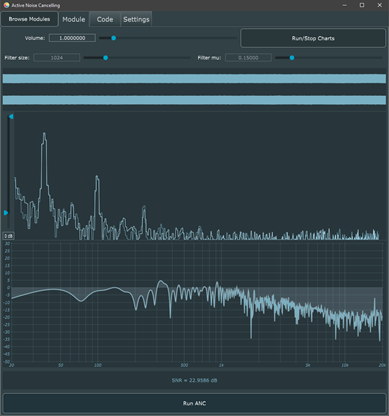

<p align="center">
  
</p>

# Active Noise Cancellation
## JUCE
JUCE is an open-source cross-platform C++ application framework used for rapidly
developing high quality desktop and mobile applications, including VST, AU (and AUv3),
RTAS and AAX audio plug-ins. JUCE can be easily integrated with existing projects or can
be used as a project generation tool via the [Projucer](https://juce.com/discover/projucer),
which supports exporting projects for Xcode (macOS and iOS), Visual Studio, Android Studio,
Code::Blocks, CLion and Linux Makefiles as well as containing a source code editor and
live-coding engine which can be used for rapid prototyping.

## Getting Started

> This project is just proof-of-concept. Do not see it as complete daily-use application

Whole application is based on JUCE's DemoRunner application. This is because it is convienient to be able to change sound cards without changing the code. Also with this solition I could implement additions such as adaptive filter visualizer or FFT visualizer. To be able to reduct noise I used FxLMS algorithm. I based the algorithm on ARM CMSIS DSP functions but I need to modify them to work propelly.

## System Requirements
#### Building JUCE Projects
- __macOS__: macOS 10.11 and Xcode 7.3.1
- __Windows__: Windows 8.1 and Visual Studio 2013 64-bit
- __Linux__: GCC 4.8, clang

#### Minimum Deployment Targets
- __macOS__: macOS 10.7
- __Windows__: Windows Vista
- __Linux__: Mainstream Linux distributions

#### Required hardware
- __Raspberry Pi__ - model 3B/3B+
- [__I2S Microphones__](https://learn.adafruit.com/adafruit-i2s-mems-microphone-breakout/raspberry-pi-wiring-and-test)
- [__I2S DAC__](https://learn.adafruit.com/adafruit-i2s-stereo-decoder-uda1334a/raspberry-pi-usage)
- or I2S board containing DAC + stereo microphone input

## Building application

Go to folder containing Makefile and run build
```
cd examples/DemoRunner/Build/LinuxMakefile
make CONFIG=Release CXX=clang++
```

## GUI
<p align="center">
  
</p>

Application GUI contains:

1. Settings: output volume, filter size, filter mu (step size) and button to stop drawing charts
2. Window which shows in real time signal in both channels
3. Window with FFT of inputs
4. Real time visualization of ANC adaptive filter
5. Button to run ANC application

> This SNR value isn't working propelly so it will be removed.. some day

## Dependencies

### JUCE Dependencies under Linux
Install them by running
```
sudo apt-get install freeglut3-dev g++ libasound2-dev libcurl4-openssl-dev \
                     libfreetype6-dev libjack-jackd2-dev libx11-dev libxcomposite-dev \
                     libxcursor-dev libxinerama-dev libxrandr-dev mesa-common-dev \
                     webkit2gtk-4.0
```
### Clang compiler
```
sudo apt-get install clang
```

### LADSPA Plugins installed
To get rid of DC offset from microphones

> __Note: If you don't have any DC offset you don't need to do that__

```
apt-get install ladspa-sdk
```
Then create a `/etc/asound.conf` file containing the following;
```
pcm.plughp {
    type ladspa
    slave.pcm "plughw:X"
    path "/usr/lib/ladspa"
    capture_plugins [
	{	
		label hpf
		id 1042
        input {
            contols [ 60 ]
        }
	}
    {
        label amp_mono
        id 1048
        input {
            controls [ 30 ]
        }
    }
    ]
}

pcm.hp {
    type plug
    slave.pcm plughp
}
```
Where `plughw:X` is your sound card containing microphones inputs. You can check it by running
```
arecord -l
```

### Linux Real Time kernel installed - [HOWTO: Install Real-Time Linux Kernel](https://hungpham2511.github.io/setup/install-rtlinux/)
You can check if you have realtime system by running code below (You should see somthing like: _4.9.47-rt37 #1 SMP PREEMPT RT_ )
```
uname -a
```
> On raspberry you can't do it easily because when you are installing microphones you are compiling new Linux kernel which is non PREEMPT or RT.
# 
### Check of low latency capabilities - [Realtime config quick scan](https://github.com/raboof/realtimeconfigquickscan)
```
git clone git://github.com/raboof/realtimeconfigquickscan.git
cd realtimeconfigquickscan
perl ./realTimeConfigQuickScan.pl
```
# 
### Adding the sound card IRQ
Open the file `/proc/interrupts`. Find your sound card. The first column represents the IRQ. Set this numer to the variable `SOUND_CARD_IRQ` in the same terminal session like this:    
```
export SOUND_CARD_IRQ={IRQ #}
```
# 
### Permit audio users to use realtime capabilities
1. Editing config files \
    If your system has no directory called `/etc/security/limits.d` then you will need to edit `/etc/security/limits.conf`. If `/etc/security/limits.d` does exist on your machine, then you will need to create and edit a file called `/etc/security/limits.d/audio.conf`. The file must contain (at least) the following two lines:
    ```
    @audio  -   rtprio  95
    @audio  -   memlock unlimited
    @audio  -   nice    -19
    ```

2. Creating "audio" groups \
    As the super-user (“root”) run the following commands from a terminal window:
    ```
    groupadd audio
    usermod -a -G audio yourUserID
    ```
    
    If you are using a distribution that has already created the group and configured the “limits” file, you will need to determine the name of the group (it is likely called “audio” or “jackuser”) and then you can just add yourself to the group with this command (run as the superuser inside a terminal window):

    ```
    usermod -a -G theGroupName yourUserId
    ```
    ___None of the changes you have made above will have any effect until you logout and back in. You do not need to reboot your system or reinstall any software.___

#  
### Modify IRQ Priorities - [HOW-TO optimize IRQs](http://subversion.ffado.org/wiki/IrqPriorities)

# 
### Reducing swappiness 
(aka swap frequency, set to 60 by default) to e.g. 10 will make the system wait much longer before trying to swap to disk (see wikipedia:Paging#Swappiness). This can be done on the fly with sysctl vm.swappiness=10 (see sysctl(8)) or setup permanently, using a configuration file (see sysctl.d(5)) such as:
```
sudo nano /etc/sysctl.d/90-swappiness.conf
#change this line
vm.swappiness = 10
```
# 
## Tips and tricks
- Disable WiFi and close any programs that don't need to be open when recording such as browsers. Many have reported disabling WiFi has led to more reliable JACK performance.

- Some USB audio hardware is known not to work properly when plugged into USB 3 ports so try USB 2/1 ports instead.

- IRQ issues can occur and cause problems. An example is video hardware reserving the bus, causing needless interrupts in the system I/O path. See discussion at FFADO IRQ Priorities How-To. If you have a realtime or a recent kernel, you can use rtirq to adjust priorities of IRQ handling threads.

- Do not use the irqbalance daemon, or do so carefully.

- If you need to use multiple audio devices with JACK2, the alsa_in and alsa_out utilities. can be used to have extra devices wrapped and show up as outputs in the JACK patchbay.

- Some daemons/processes can unexpectedly cause xruns. If you do not need it - kill it. No questions asked.

- If you are facing a lot of xruns especially with nvidia, disable your GPU throttling. This can be done via the card's control applet and for nvidia it is "prefer maximum performance"

## License
The core JUCE modules (juce_audio_basics, juce_audio_devices, juce_blocks_basics, juce_core
and juce_events) are permissively licensed under the terms of the
[ISC license](http://www.isc.org/downloads/software-support-policy/isc-license/).
Other modules are covered by a
[GPL/Commercial license](https://www.gnu.org/licenses/gpl-3.0.en.html).

There are multiple commercial licensing tiers for JUCE 5, with different terms for each:
- JUCE Personal (developers or startup businesses with revenue under 50K USD) - free
- JUCE Indie (small businesses with revenue under 200K USD) - $35/month
- JUCE Pro (no revenue limit) - $65/month
- JUCE Eductational (no revenue limit) - free for bona fide educational institutes

For full terms see [LICENSE.md](LICENSE.md).
